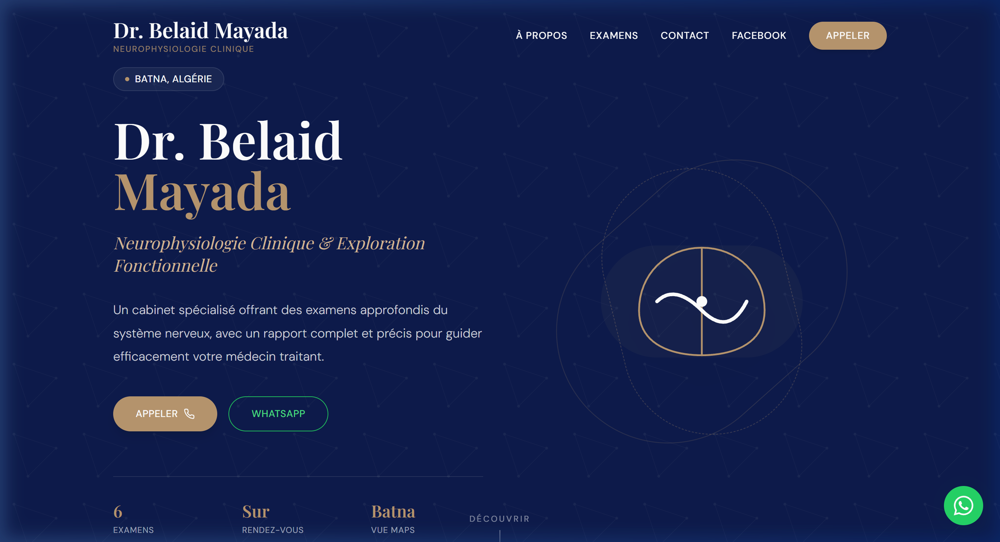
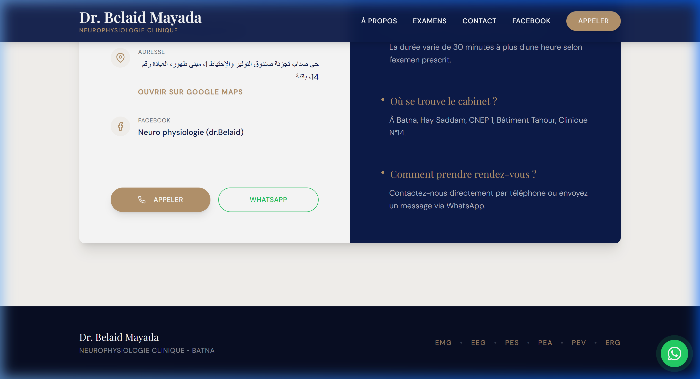

# Dr. Belaid Mayada - Neurophysiologie Clinique

Official website for the Neurophysiology and Functional Exploration clinic of Dr. Belaid Mayada, located in Batna, Algeria.

## 🔗 Live Demo
**[medical-clinic-weld.vercel.app](https://medical-clinic-weld.vercel.app/)**

## ✨ Features
- **Luxury Design System**: Built with a custom navy, gold, and cream color palette.
- **Interactive UI**: Fluid animations using Framer Motion and React.
- **Custom Illustrations**: Minimalist SVG illustrations for specialized medical exams (EMG, EEG, PES, etc.).
- **Responsive Layout**: Fully optimized for mobile, tablet, and desktop.
- **Quick Contact**: Integrated WhatsApp and Click-to-Call functionality.
- **SEO Optimized**: Semantic HTML and meta tags for better visibility.

## 📸 Screenshots

### Header & Hero

### Contact & FAQ

## 🛠️ Tech Stack
- **Frontend**: React (via CDN)
- **Styling**: Tailwind CSS
- **Animations**: Framer Motion
- **Typography**: Google Fonts (Playfair Display & DM Sans)
- **Hosting**: Vercel

---
*Created with ❤️ for Dr. Belaid Mayada.*
